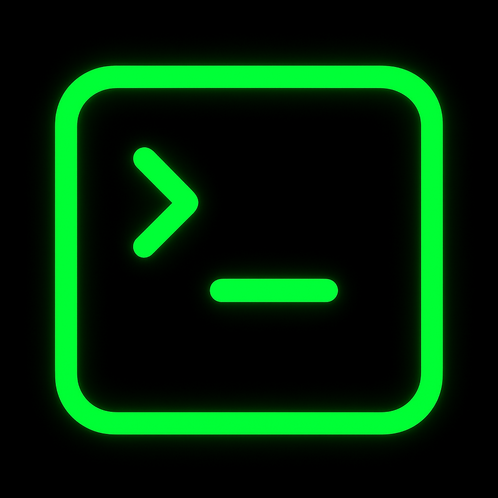
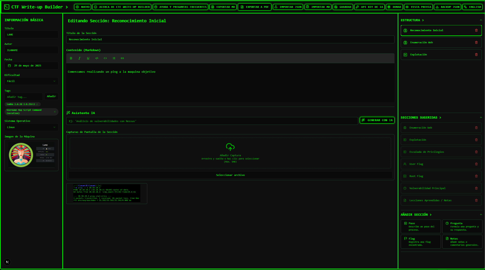
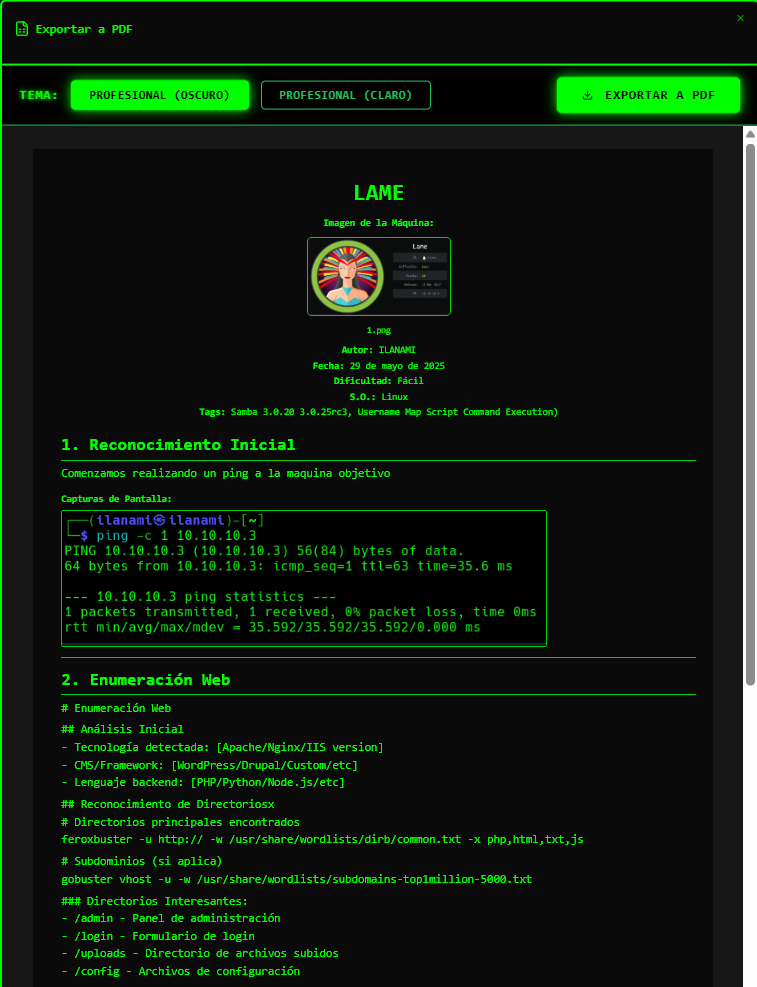

<p align="right">
  🇺🇸 <a href="./README.md">Read in English</a>
</p>

#     CTF Write-up Builder

[](https://nextjs.org/)
[](https://reactjs.org/)
[](https://www.typescriptlang.org/)
[](https://github.com/ilanami/ctf_writeup_builder)
[](https://opensource.org/licenses/MIT)

> **Una aplicación moderna y privada para crear, organizar y exportar write-ups de CTF con ayuda de IA**

Diseñada por y para la comunidad de ciberseguridad, CTF Write-up Builder te permite documentar tus CTFs de manera profesional con soporte para Markdown, capturas automáticas, generación de contenido con IA y exportación múltiple.

## 🌐 Demo Live

**[🚀 Prueba la aplicación aquí](https://ctf-writeup-builder.vercel.app/)**

*Sin registro, sin tracking, sin límites. Tu privacidad es nuestra prioridad.*

## 📸 Screenshots

| Vista Principal | Editor con IA | Exportación |
|-----------------|---------------|-------------|
|  |  |  |

## ✨ Características Principales

### 🤖 **Generación Inteligente con IA**
- **Google Gemini** y **OpenAI ChatGPT** integrados
- Genera contenido específico para cada sección
- Análisis de vulnerabilidades automatizado
- Sugerencias contextuales de herramientas

### 📝 **Editor Avanzado**
- **Markdown** nativo con vista previa en tiempo real
- **Capturas de pantalla** integradas por sección
- **Plantillas** predefinidas para diferentes tipos de CTF
- **Tags** personalizables para organización

### 📄 **Exportación Múltiple**
- **PDF** profesional con formato optimizado
- **Markdown** estándar para GitHub/GitLab
- **JSON** para backup y colaboración

### 🌐 **Multi-idioma**
- **Español** e **Inglés** completos
- Interfaz adaptativa según región
- Prompts de IA localizados

### 🛡️ **Privacidad y Seguridad**
- **100% local** - Sin servidores externos
- **API keys encriptadas** localmente
- **Código abierto** - Auditado completamente
- **Sin tracking** ni telemetría

### 📱 **Experiencia de Usuario**
- **Responsive design** - Funciona en móvil y desktop
- **Tema hacker** con estética profesional
- **Auto-guardado** para prevenir pérdida de datos

## 🚀 Instalación

### Prerequisitos
- **Node.js** 18.0 o superior
- **npm** o **yarn**

### Instalación Local

```bash
# Clonar el repositorio
git clone https://github.com/ilanami/ctf_writeup_builder.git

# Navegar al directorio
cd ctf_writeup_builder

# Instalar dependencias
npm install

# Ejecutar en modo desarrollo
npm run dev
```

La aplicación estará disponible en `http://localhost:3000`

### Build para Producción

```bash
# Crear build optimizado
npm run build

# Ejecutar en producción
npm start
```

## 🐳 Ejecutar con Docker (Español)

Para un inicio rápido y aislado, puedes ejecutar la aplicación usando la imagen oficial de Docker disponible en Docker Hub.

### Prerrequisitos
* Docker Desktop instalado y en ejecución.

### Inicio Rápido

1. **Descargar la imagen desde Docker Hub:**
   ```bash
   docker pull ilanamin/ctf-writeup-builder:1.0
   ```

2. **Ejecutar el contenedor:**
   ```bash
   docker run -d -p 3000:3000 --name ctf-app ilanamin/ctf-writeup-builder:1.0
   ```

3. **Abrir la aplicación:**
   Navega a `http://localhost:3000` en tu navegador web.

### Comandos de Docker

* **Detener el contenedor:**
  ```bash
  docker stop ctf-app
  ```

* **Iniciar el contenedor de nuevo:**
  ```bash
  docker start ctf-app
  ```

* **Ver los logs:**
  ```bash
  docker logs ctf-app
  ```

* **Eliminar el contenedor:**
  ```bash
  docker rm ctf-app
  ```

## 💡 Cómo Usar

### 1. **Configurar IA (Opcional)**
- Haz clic en **"API Key"** en la barra superior
- Elige entre **Google Gemini** o **OpenAI**
- Ingresa tu API key personal
- [📖 Cómo obtener API Keys](#-configuración-de-apis)

### 2. **Crear Write-up**
- Clic en **"Nuevo"** para empezar
- Completa información básica (título, dificultad, etc.)
- Agrega secciones según tu metodología

### 3. **Generar Contenido con IA**
- En cada sección, clic en **"Generar con IA"**
- Describe brevemente lo que encontraste
- La IA generará contenido profesional

### 4. **Agregar Capturas**
- Usa **"Añadir Captura"** en cada sección
- Arrastra y suelta imágenes
- Capturas se incluyen automáticamente en exports

### 5. **Exportar**
- **PDF** para reportes profesionales
- **Markdown** para documentación
- **JSON** para backup/colaboración

## 🔑 Configuración de APIs

### Google Gemini (Recomendado - Gratuito)
1. Ve a [Google AI Studio](https://makersuite.google.com/app/apikey)
2. Crea una nueva API Key
3. Cópiala en la configuración de la app

### OpenAI ChatGPT
1. Ve a [OpenAI Platform](https://platform.openai.com/api-keys)
2. Crea una nueva API Key (comienza con `sk-`)
3. Cópiala en la configuración de la app

> 🔒 **Seguridad**: Tus API keys se almacenan codificadas localmente. Nunca se envían a servidores externos excepto a los proveedores de IA para generar contenido.

## 🏗️ Arquitectura Técnica

### Stack Tecnológico
- **Frontend**: Next.js 15, React 18, TypeScript
- **Styling**: Tailwind CSS, CSS Modules
- **State**: React Context + useReducer
- **IA**: Google Gemini & OpenAI APIs
- **Security**: DOMPurify, Input sanitization
- **Performance**: React.memo, useCallback optimizations

### Estructura del Proyecto
```
src/
├── app/                 # Next.js App Router
├── components/          # Componentes React reutilizables
├── contexts/           # Estado global (Context API)
├── utils/              # Utilidades y helpers
├── ai/                 # Integración con APIs de IA
└── types/              # Definiciones TypeScript
```

## 🛡️ Seguridad

Esta aplicación ha sido auditada completamente para seguridad:

- ✅ **XSS Prevention** - DOMPurify en todo HTML dinámico
- ✅ **Input Sanitization** - Validación en todas las entradas
- ✅ **API Security** - Keys codificadas localmente
- ✅ **Dependency Audit** - Sin vulnerabilidades conocidas
- ✅ **OWASP Compliance** - Mejores prácticas implementadas

Ver [SECURITY.md](SECURITY.md) para detalles completos.

## 🌍 Multi-idioma

Idiomas soportados:
- 🇪🇸 **Español** (España/Latinoamérica)
- 🇺🇸 **English** (US/International)

¿Quieres agregar tu idioma? [Contribuye aquí](#-contribuir)

## 📋 Roadmap

### v1.1 - Performance Plus
- [ ] Lazy loading completo
- [ ] Virtual scrolling para listas grandes
- [ ] Bundle size optimization

### v1.2 - UX Enhancements
- [ ] Más plantillas de CTF
- [ ] Keyboard shortcuts
- [ ] Drag & drop para reorganizar secciones

### v1.3 - Collaboration
- [ ] Export a más formatos (DOCX, HTML)
- [ ] Integración con Git
- [ ] Modo colaborativo básico

### v1.4 - Advanced Features
- [ ] Plugin system
- [ ] Custom AI prompts
- [ ] Integration con plataformas CTF

## 🤝 Contribuir

¡Las contribuciones son bienvenidas! Esta aplicación es hecha por y para la comunidad CTF.

### Formas de Contribuir
- 🐛 **Reportar bugs** en [Issues](https://github.com/ilanami/ctf_writeup_builder/issues)
- 💡 **Sugerir features** nuevas
- 🌍 **Traducir** a nuevos idiomas
- 🔧 **Enviar** Pull Requests
- ⭐ **Dar estrella** al proyecto

### Desarrollo Local
```bash
# Fork del repositorio
# Clonar tu fork
git clone https://github.com/TU-USERNAME/ctf_writeup_builder.git

# Crear rama para tu feature
git checkout -b feature/nueva-funcionalidad

# Hacer cambios y commit
git commit -m "feat: agregar nueva funcionalidad"

# Push y crear Pull Request
git push origin feature/nueva-funcionalidad
```

## 🎁 Apoya mis Proyectos y Herramientas

Si te han gustado mis proyectos y herramientas y te han sido útil, considera comprarme un café o realizarme una donación como agradecimiento.

No es obligatorio, pero me ayudaría muchísimo a seguir creando herramientas como esta y a pagar las certificaciones de ciberseguridad que quiero obtener.

¡Muchas gracias por tu apoyo!

[](https://www.paypal.me/1511amff)
[](https://buymeacoffee.com/ilanami)

## 📞 Soporte y Contacto

### 🐛 Reportar Issues
- **GitHub Issues**: [Crear nuevo issue](https://github.com/ilanami/ctf_writeup_builder/issues/new)
- **Email**: writeup_builder@proton.me

### 📧 Contacto Directo
Para consultas generales, colaboraciones o propuestas:
**writeup_builder@proton.me**

## 📄 Licencia

Este proyecto está bajo la licencia MIT. Ver [LICENSE](LICENSE) para detalles.

## ⚠️ Nota sobre Content Security Policy (CSP) y 'unsafe-eval'

Para que todas las funciones de la aplicación funcionen correctamente en modo desarrollo, la política de seguridad de contenido (CSP) permite 'unsafe-eval' **solo en desarrollo**. Esto es necesario porque algunas dependencias lo requieren para funcionar localmente.

**En producción** (por ejemplo, en Vercel), la configuración de CSP **no incluye** 'unsafe-eval', por lo que la aplicación es segura y cumple con los estándares de seguridad de la plataforma.

**No modifiques la política CSP para permitir 'unsafe-eval' en producción.**
La configuración actual ya gestiona esto automáticamente según el entorno.

#### Si tienes problemas con botones o funciones que no responden en desarrollo:

1. Abre el archivo `next.config.mjs` en la raíz del proyecto.
2. Asegúrate de que la línea de la política CSP esté así:
   ```js
   {
     key: 'Content-Security-Policy',
     value: process.env.NODE_ENV === 'development'
       ? "default-src 'self'; img-src 'self' data: https:; script-src 'self' 'unsafe-inline' 'unsafe-eval'; style-src 'self' 'unsafe-inline'; object-src 'none'; base-uri 'self';"
       : "default-src 'self'; img-src 'self' data: https:; script-src 'self' 'unsafe-inline'; style-src 'self' 'unsafe-inline'; object-src 'none'; base-uri 'self';"
   },
   ```
3. Guarda el archivo y reinicia el servidor de desarrollo con:
   ```bash
   npm run dev
   ```
4. Recarga la página en el navegador con `Ctrl + F5`.

**En producción, 'unsafe-eval' NO está permitido y la aplicación es segura.**

## 🙏 Agradecimientos

Gracias a todos los jugadores de CTF, contribuidores open source y la comunidad de ciberseguridad que hicieron posible este proyecto.

### Tecnologías Utilizadas
- [Next.js](https://nextjs.org/) - Framework React
- [Tailwind CSS](https://tailwindcss.com/) - Styling
- [Google Gemini](https://gemini.google.com/) - IA para generación
- [OpenAI](https://openai.com/) - IA alternativa
- [DOMPurify](https://github.com/cure53/DOMPurify) - Sanitización XSS

---

<div align="center">

**⭐ Si este proyecto te ayuda, considera darle una estrella ⭐**

**Hecho con ❤️ para la comunidad CTF**

[🚀 Probar Aplicación](https://ctf-writeup-builder.vercel.app) • [📖 Documentación](https://github.com/ilanami/ctf_writeup_builder/wiki) • [🐛 Reportar Bug](https://github.com/ilanami/ctf_writeup_builder/issues)

</div> 
