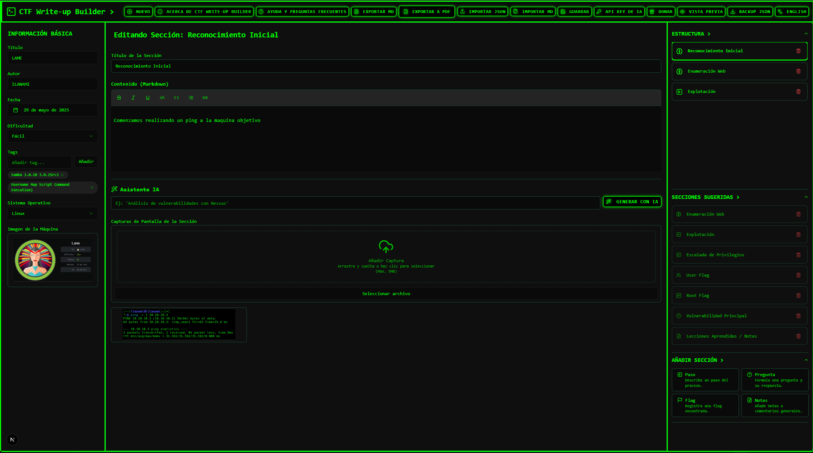
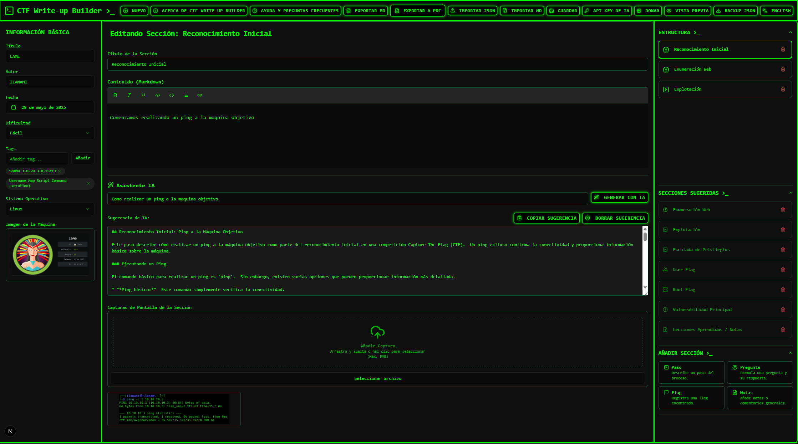
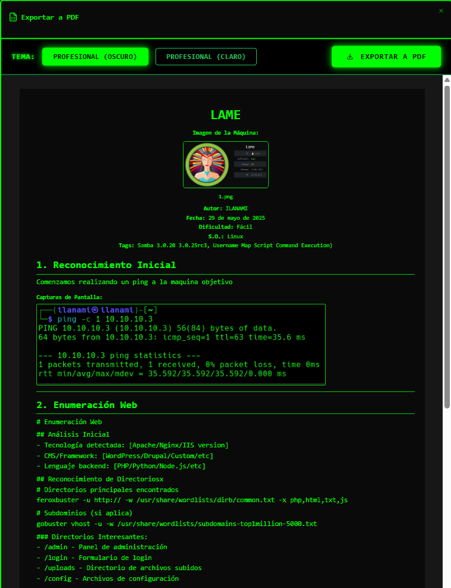

<p align="right">
  🇪🇸 <a href="./README.es.md">Leer en Español</a>
</p>

#     CTF Write-up Builder

[](https://nextjs.org/)
[](https://reactjs.org/)
[](https://www.typescriptlang.org/)
[](https://github.com/ilanami/ctf_writeup_builder)
[](https://opensource.org/licenses/MIT)

> **A modern and private application for creating, organizing and exporting CTF write-ups with AI assistance**

Designed by and for the cybersecurity community, CTF Write-up Builder allows you to document your CTFs professionally with Markdown support, automatic screenshots, AI content generation, and multiple export formats.

## 🌐 Live Demo

**[🚀 Try the application here](https://ctf-writeup-builder.vercel.app)**

*No registration, no tracking, no limits. Your privacy is our priority.*

## 📸 Screenshots

| Main View | AI Editor | Export |
|-----------|-----------|---------|
|  |  |  |

## ✨ Key Features

### 🤖 **Intelligent AI Generation**
- **Google Gemini** and **OpenAI ChatGPT** integrated
- Generate specific content for each section
- Automated vulnerability analysis
- Contextual tool suggestions

### 📝 **Advanced Editor**
- Native **Markdown** with real-time preview
- Integrated **screenshots** per section
- Predefined **templates** for different CTF types
- Customizable **tags** for organization

### 📄 **Multiple Export Formats**
- Professional **PDF** with optimized formatting
- Standard **Markdown** for GitHub/GitLab
- **JSON** for backup and collaboration

### 🌐 **Multi-language**
- Complete **Spanish** and **English**
- Adaptive interface by region
- Localized AI prompts

### 🛡️ **Privacy and Security**
- **100% local** - No external servers
- **Encrypted API keys** stored locally
- **Open source** - Fully audited
- **No tracking** or telemetry

### 📱 **User Experience**
- **Responsive design** - Works on mobile and desktop
- Professional **hacker theme**
- **Auto-save** to prevent data loss

## 🚀 Installation

### Prerequisites
- **Node.js** 18.0 or higher
- **npm** or **yarn**

### Local Installation

```bash
# Clone the repository
git clone https://github.com/ilanami/ctf_writeup_builder.git

# Navigate to directory
cd ctf_writeup_builder

# Install dependencies
npm install

# Run in development mode
npm run dev
```

The application will be available at `http://localhost:3000`

### Production Build

```bash
# Create optimized build
npm run build

# Run in production
npm start
```

## 💡 How to Use

### 1. **Configure AI (Optional)**
- Click **"API Key"** in the top bar
- Choose between **Google Gemini** or **OpenAI**
- Enter your personal API key
- [📖 How to get API Keys](#-api-configuration)

### 2. **Create Write-up**
- Click **"New"** to start
- Fill in basic information (title, difficulty, etc.)
- Add sections according to your methodology

### 3. **Generate Content with AI**
- In each section, click **"Generate with AI"**
- Briefly describe what you found
- AI will generate professional content

### 4. **Add Screenshots**
- Use **"Add Screenshot"** in each section
- Drag and drop images
- Screenshots are automatically included in exports

### 5. **Export**
- **PDF** for professional reports
- **Markdown** for documentation
- **JSON** for backup/collaboration

## 🔑 API Configuration

### Google Gemini (Recommended - Free)
1. Go to [Google AI Studio](https://makersuite.google.com/app/apikey)
2. Create a new API Key
3. Copy it to the app configuration

### OpenAI ChatGPT
1. Go to [OpenAI Platform](https://platform.openai.com/api-keys)
2. Create a new API Key (starts with `sk-`)
3. Copy it to the app configuration

> 🔒 **Security**: Your API keys are stored encoded locally. They are never sent to external servers except to AI providers for content generation.

## 🏗️ Technical Architecture

### Technology Stack
- **Frontend**: Next.js 15, React 18, TypeScript
- **Styling**: Tailwind CSS, CSS Modules
- **State**: React Context + useReducer
- **AI**: Google Gemini & OpenAI APIs
- **Security**: DOMPurify, Input sanitization
- **Performance**: React.memo, useCallback optimizations

### Project Structure
```
src/
├── app/                 # Next.js App Router
├── components/          # Reusable React components
├── contexts/           # Global state (Context API)
├── utils/              # Utilities and helpers
├── ai/                 # AI API integrations
└── types/              # TypeScript definitions
```

## 🛡️ Security

This application has been fully audited for security:

- ✅ **XSS Prevention** - DOMPurify on all dynamic HTML
- ✅ **Input Sanitization** - Validation on all inputs
- ✅ **API Security** - Keys encoded locally
- ✅ **Dependency Audit** - No known vulnerabilities
- ✅ **OWASP Compliance** - Best practices implemented

See [SECURITY.md](SECURITY.md) for complete details.

## 🌍 Multi-language

Supported languages:
- 🇪🇸 **Español** (Spain/Latin America)
- 🇺🇸 **English** (US/International)

Want to add your language? [Contribute here](#-contributing)

## 📋 Roadmap

### v1.1 - Performance Plus
- [ ] Complete lazy loading
- [ ] Virtual scrolling for large lists
- [ ] Bundle size optimization

### v1.2 - UX Enhancements
- [ ] More CTF templates
- [ ] Keyboard shortcuts
- [ ] Drag & drop to reorganize sections

### v1.3 - Collaboration
- [ ] Export to more formats (DOCX, HTML)
- [ ] Git integration
- [ ] Basic collaborative mode

### v1.4 - Advanced Features
- [ ] Plugin system
- [ ] Custom AI prompts
- [ ] CTF platform integrations

## 🤝 Contributing

Contributions are welcome! This application is made by and for the CTF community.

### Ways to Contribute
- 🐛 **Report bugs** in [Issues](https://github.com/ilanami/ctf_writeup_builder/issues)
- 💡 **Suggest features**
- 🌍 **Translate** to new languages
- 🔧 **Submit** Pull Requests
- ⭐ **Star** the project

### Local Development
```bash
# Fork the repository
# Clone your fork
git clone https://github.com/YOUR-USERNAME/ctf_writeup_builder.git

# Create branch for your feature
git checkout -b feature/new-functionality

# Make changes and commit
git commit -m "feat: add new functionality"

# Push and create Pull Request
git push origin feature/new-functionality
```

## ☕ Support the Project

If this tool has been useful to you and has helped you in your CTFs or cybersecurity certifications, consider supporting development with a donation. **It's not mandatory**, but it would help me tremendously to continue creating tools like this and to pay for the cybersecurity certifications I want to obtain.

### 💝 Ways to Donate
- 💳 **PayPal**: [Donate with PayPal](https://paypal.me/yourusername) *(Update with your real link)*
- ☕ **Buy me a coffee**: [buymeacoffee.com/yourusername](https://buymeacoffee.com/yourusername) *(Update with your real link)*

> 🙏 **Thank you so much for your support!** Every donation, no matter how small, helps maintain this project and develop new features.

## 📞 Support and Contact

### 🐛 Report Issues
- **GitHub Issues**: [Create new issue](https://github.com/ilanami/ctf_writeup_builder/issues/new)
- **Email**: writeup_builder@proton.me

### 📧 Direct Contact
For general inquiries, collaborations or proposals:
**writeup_builder@proton.me**

## 📄 License

This project is under the MIT license. See [LICENSE](LICENSE) for details.

```
MIT License - You can use, modify and distribute freely
```

## 🙏 Acknowledgments

Thanks to all CTF players, open source contributors and the cybersecurity community that made this project possible.

### Technologies Used
- [Next.js](https://nextjs.org/) - React Framework
- [Tailwind CSS](https://tailwindcss.com/) - Styling
- [Google Gemini](https://gemini.google.com/) - AI for generation
- [OpenAI](https://openai.com/) - Alternative AI
- [DOMPurify](https://github.com/cure53/DOMPurify) - XSS Sanitization

---

<div align="center">

**⭐ If this project helps you, consider giving it a star ⭐**

**Made with ❤️ for the CTF community**

[🚀 Try Application](https://ctf-writeup-builder.vercel.app) • [📖 Documentation](https://github.com/ilanami/ctf_writeup_builder/wiki) • [🐛 Report Bug](https://github.com/ilanami/ctf_writeup_builder/issues)

</div>
